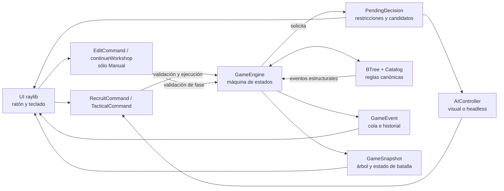

# Arquitectura

Operación Yggdrasil tiene un solo motor de reglas. La interfaz raylib y la IA
son clientes del mismo `GameEngine`: ninguna replica el combate, modifica el
Árbol B-4 durante el renderizado ni calcula resultados visuales por su cuenta.

## Flujo comando–decisión–evento–snapshot

1. `GameEngine::pump()` avanza una unidad de trabajo de la máquina de estados:
   inicio de turno, taller, reclutamiento, preparación y acciones de combate,
   limpieza o cierre del turno. En Manual se detiene en `Stage::Workshop`; la
   UI sólo puede salir mediante `continueWorkshop()`. IA vs IA atraviesa ese
   estado inmediatamente, sin ejecutar ediciones.
2. Si hace falta intervención, el motor publica un `PendingDecision` y deja de
   avanzar. El objeto identifica la facción, el tipo de decisión, las opciones
   legales y las restricciones de fase.
3. En Manual, la UI construye el comando desde un diálogo. En IA vs IA,
   `AIController` resuelve exactamente el mismo objeto. Ambos pasan por
   `validateRecruit`, `submitRecruit` o `submitTactical`. `editOperative` y
   `continueWorkshop` sólo aceptan la fase Taller Manual.
4. El motor acepta o rechaza el comando sin crear estados parciales. Un comando
   aceptado modifica el estado canónico y emite `GameEvent` con datos
   estructurados; un rechazo devuelve una explicación para la UI o el runner.
5. La UI consume los eventos en orden para el registro y los efectos. Para
   dibujar consulta un `GameSnapshot`, copia coherente de fase, turno,
   estadísticas, victoria y topología del Árbol B-4.

La cola permite espaciar visualmente los sucesos sin detener el motor. El
historial completo conserva el orden y alimenta el registro;
`VictorySummary` concentra las cifras finales y `historyDigest()` permite
comprobar que una semilla repite la misma simulación.

El orden del inicio de turno Manual es deliberado: `beginTurn()` publica la
fase Taller y espera; `continueWorkshop()` llama a `beginRecruitment()`, que
primero rearma operativos sin arma en los turnos pares desde el 4 y sólo después
calcula las inserciones y publica la decisión de reclutamiento. Así, el CRUD
siempre observa el estado anterior al rearme y nunca se mezcla con una decisión
pendiente.

## Capas

### Núcleo (`include/yggdrasil/core`, `src/core`)

- `types`: `Operative`, cola FIFO de armas, pila LIFO de escudos y facciones.
- `catalog`: lectura transaccional y localización de los cinco catálogos.
- `btree`: inserción, split, borrado, borrow, merge, reducción de raíz,
  validación de invariantes y snapshots con identificadores estables de nodo.
- `game_engine`: RNG sembrado, taller y CRUD validados, rearme, reclutamiento,
  combate, habilidades, limpieza diferida, dominio de raíz, límites y victoria.
- `event`: vocabulario común de fases y sucesos observables.

`BTree` informa sus cambios estructurales mediante un sink. `GameEngine` los
traduce a la misma secuencia de `GameEvent` que usa para ataques, escudos,
habilidades y victoria; por eso un split mostrado corresponde a un split real.

### IA (`include/yggdrasil/ai`, `src/ai`)

`AIController` selecciona plantillas, IDs, objetivos y destinos entre las
opciones legales. Puntúa impacto, vecindad y predicciones de inserción, y usa el
RNG del motor para desempatar. `runHeadless()` alterna `pump()` y `resolve()`;
no existe un simulador de reglas alternativo.

### Interfaz (`include/yggdrasil/ui`, `src/ui`)

`GameApp` posee la ventana y ejecuta un bucle no bloqueante. Convierte entrada
en comandos, consume eventos a la velocidad elegida y representa snapshots.
La cámara, paneles, modales, historial y efectos son estado de presentación;
no son autoridad sobre HP, daño, facción, IDs ni topología.

## Datos y reproducibilidad

Los catálogos permanecen fuera del binario. La búsqueda prueba, en orden, el
directorio indicado por `--data-dir`, `data/` junto al ejecutable, `../data`
desde el ejecutable y `data/` desde el directorio de trabajo. CMake copia los
datos al árbol de build para que ejecutar allí no dependa del checkout.

Una partida parte de `GameConfig`, incluida una semilla de 64 bits. El motor y
la IA comparten un único `std::mt19937_64`; repetir configuración, catálogos y
semilla reproduce el historial. La velocidad y la reducción de efectos sólo
cambian la presentación.

## Invariantes y límites de responsabilidad

- Un nodo B-4 estable contiene de una a tres claves ordenadas y todos sus hijos
  tienen la misma profundidad.
- El ID es la clave: cambiarlo se implementa como borrado y reinserción.
- El CRUD sólo existe en la fase Taller Manual. Edita cualquier entrada de las
  colecciones sin cambiar su orden: el frente sigue siendo el arma activa y el
  tope sigue siendo el escudo activo.
- Muertes y Disrupciones se acumulan durante el recorrido y se aplican en
  limpieza, evitando invalidar la iteración de combate.
- El escudo activo es `shields.back()`; el arma activa es `weapons.front()`.
- Sólo el núcleo decide daño, absorción, consumo, conversión, reubicación y
  victoria.
- Los ejecutables de pruebas enlazan el mismo núcleo que la aplicación.

La caracterización exacta de las reglas heredadas y su procedencia está en
[`CANONICAL_ENGINE.md`](CANONICAL_ENGINE.md).
