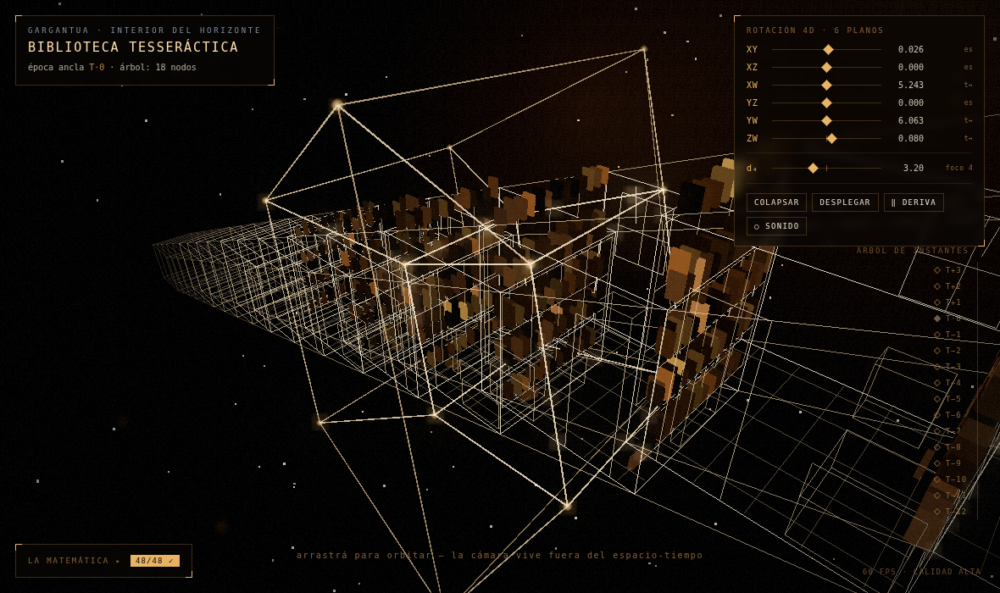

# Biblioteca Tesseráctica — Interstellar 4D

Simulación interactiva de la escena del teseracto de *Interstellar*: la habitación
de Murph repetida a lo largo del eje temporal W, navegable, con matemática real de
proyección 4D y recursión genuina de generación de escena. Un único artifact HTML
autocontenido (React + Three.js empaquetados inline, cero peticiones externas).



## Qué hay de real acá adentro

**Geometría N-dimensional** (`src/math.js`)
- `generateHypercube(n)` construye el n-cubo por recursión estructural: dos
  (n−1)-cubos unidos vértice a vértice; caso base el 0-cubo. Validado en vivo
  para n = 0…5 (2ⁿ vértices, n·2ⁿ⁻¹ aristas).
- Las 6 matrices de rotación de R⁴ (XY, XZ, XW, YZ, YW, ZW), todas expuestas al
  usuario como diales de velocidad angular; ortogonalidad y det = +1 verificados.
- Pipeline de proyección en dos etapas puras y testeables: perspectiva 4D→3D con
  focal d₄ ajustable (escala = d₄/(d₄−w)) y pinhole 3D→2D — esta última se usa en
  producción para anclar el marcador del HUD a la habitación seleccionada.

**Recursión escénica: un árbol de verdad** (`src/corridor.js`)
- `renderRoom(depth, transform)` emite una habitación y se llama a sí misma con
  **branching factor variable**: los instantes donde el usuario intervino sobre el
  polvo (cada señal Morse) se vuelven nodos de bifurcación con 2-3 hijos — líneas
  de tiempo alternativas que divergen lateralmente en Y/Z además de avanzar en W.
  Los instantes sin intervención siguen siendo lineales. Hacia el pasado se
  recorre la cadena de padres, y en las bifurcaciones ya existentes **los caminos
  no tomados también se despliegan**.
- Identidad de nodos por camino: `(t, tag)` donde `tag` es la historia de
  bifurcaciones (`"τ:j;…"`). La clave única por nodo garantiza la propiedad de
  árbol — aristas = nodos − 1 — verificada en vivo al arrancar y ejercitada por
  el verificador e2e después de bifurcar.
- Casos base explícitos, lo que ocurra primero: profundidad máxima, umbral de
  escala proyectada (= distancia 4D) y presupuesto total de nodos.
- El encogimiento Droste **no es un factor artístico**: es la perspectiva 4D real
  aplicada al punto 4D completo de cada nodo `[ox, oy, oz, w]` (offset de rama +
  avance temporal). Colapsá los ángulos y el árbol se anida concéntrico; girá XW
  y el tiempo se despliega como eje espacial.
- Entrar en una habitación re-ancla el árbol recursivo en ese nodo — incluso
  dentro de una rama alternativa (la época y la línea se muestran en el HUD; los
  libros de cada nodo persisten porque se siembran por su clave, así cada línea
  temporal tiene su propio libro caído).
- LOD por profundidad: 4 niveles (libros instanciados + mobiliario en aristas →
  estanterías → jaula → aristas mínimas) con materiales cada vez más simples.
- Los nodos de bifurcación se distinguen: estrella de aristas convergentes + halo
  pulsante, badge `⑂k` en el HUD, y los rieles de universo (aristas padre→hijo
  del árbol) se abren físicamente en varios caminos.

**Polvo gravitacional** (`src/dust.js`, `src/noise.js`)
- Campo pseudo-curl de ruido de gradiente propio (divergencia ~0) + pozos de
  gravedad del puntero (atracción + remolino) + amortiguación.
- Al acumular suficiente energía de perturbación, las partículas de la habitación
  ancla reciben blancos con resorte crítico y forman barras Morse en el piso —
  **S T A Y** con timing Morse real (raya = 3 puntos) — y se dispersan. Los
  resortes conviven con el resto de las fuerzas: se puede seguir perturbando
  durante la formación.

**Validaciones automáticas** (`src/validate.js`) — 48 checks con `console.assert`
al arrancar: conteos de hipercubos, ortogonalidad, proyecciones, terminación de la
recursión por sus casos base (incluida una corrida de 3000 niveles por rama sin
desbordar la pila), estructura de árbol con intervenciones (aristas = nodos − 1,
claves únicas, 3 hijos en el nodo intervenido, la rama pasada no tomada existe,
corte por presupuesto), cero geometría huérfana tras 3 re-anclajes, y dos
guardias de regresión en cada carga: cobertura de render (habitaciones en escena
= nodos del registro = corrida en seco) y la sonda de ENTRAR (el re-anclaje
dispara un cambio de estado verificable, con log del nuevo nodo ancla). El
resultado se muestra en el panel «LA MATEMÁTICA» del HUD.

**Capa visual** (`src/engine.js`)
- Paleta fiel: negros profundos, ámbar/dorado Hoytema, acento acero mínimo.
- Bloom controlado (UnrealBloomPass a media resolución) + grano y viñeta fílmicos
  en un ShaderPass propio; niebla exponencial.
- Cámara no-euclidiana: resortes críticos con inercia, acople de alabeo al giro,
  balanceo por ruido, fov respirando; deriva cinematográfica en reposo.
- Governor de calidad: si el fps sostenido baja de ~34, reduce polvo, resolución
  de bloom y pixel ratio (y vuelve a subir si sobra). **Nunca poda el árbol**:
  la profundidad y el presupuesto de la recursión son fijos, así lo renderizado
  siempre corresponde a los instantes reales — verificado en cada carga y en
  cada reconstrucción con un `console.assert` de cobertura (escena = registro =
  corrida en seco de la misma recursión).

## Interacción

| Gesto | Efecto |
| --- | --- |
| arrastrar | orbitar (con inercia y alabeo) |
| rueda / pinza | acercarse |
| clic en habitación | seleccionar nodo · segundo clic o ⏎ entra (elegir rama) |
| ← → / [ ] | recorrer el árbol (incluye ramas) · Esc deselecciona |
| mantener presionado | pozo de gravedad concentrado sobre el polvo |
| agitar el polvo con energía | la señal responde y **bifurca la línea de tiempo** ⑂ |
| espacio | pausar la deriva 4D |
| diales XY…ZW, d₄ | velocidades de los 6 planos y focal 4D |

## Desarrollo

```bash
npm install
npm run build    # → dist/index.html (artifact único autocontenido)
npm run verify   # Chromium headless: validaciones + picking + re-anclaje + capturas
```

`verify.mjs` carga el artifact real, espera el primer frame, lee las 46
validaciones, ejercita picking sintético, re-anclaje a T−2, la señal Morse (y
comprueba que bifurca el árbol manteniendo aristas = nodos − 1), entra a una
rama alternativa, y deja capturas en `shots/`.
